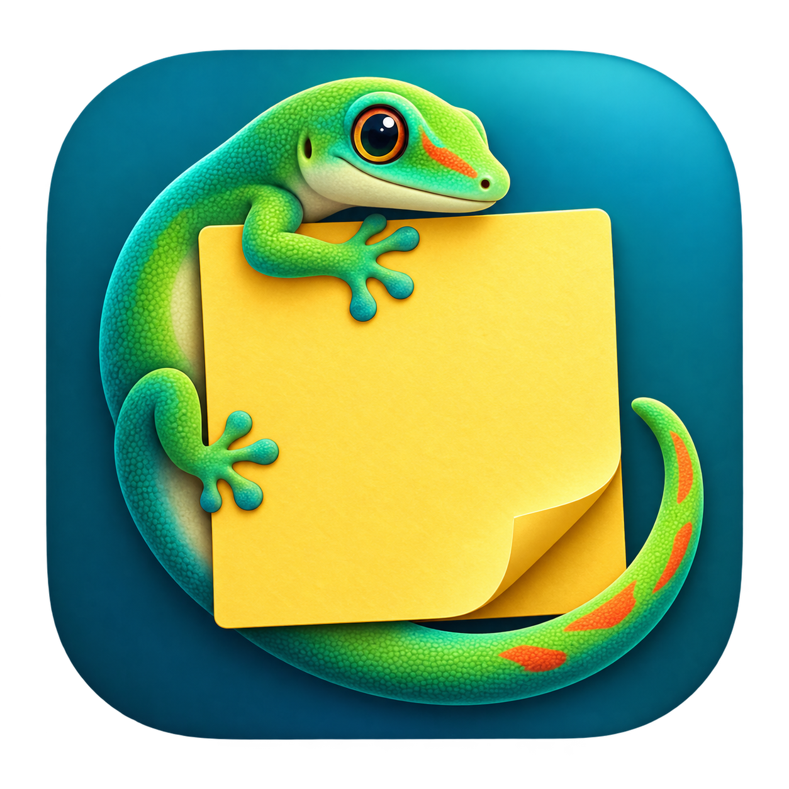

<div align="center">
  
  <h1>Phelsuma</h1>
</div>

Native macOS desktop stickies, with a markdown file per note that you can sync with Syncthing, iCloud, etc...

I got annoyed at the macOS Stickies app not being synced like Apple Notes, so I asked the code goblins to build this.

## Build and run

Requires macOS and a Swift 6 toolchain (Xcode or recent Command Line Tools).

```sh
scripts/test.sh
scripts/build-app.sh
open build/Phelsuma.app
```

Use `scripts/build-app.sh release` for an optimized build. The resulting app is signed locally with an ad-hoc signature; distribution to other people still needs Developer ID signing and notarization. There are no third-party dependencies. The package can also be opened in Xcode.

The deployment target is macOS 13. The current development Mac is the only OS/device verified so far; current Swift Testing tooling may require macOS 14 or later to run the tests.

## Using the app

**It should work exactly like the macOS Stickies app.**

Each note is an independent window. Double-click its top strip to fold it. Use the Color and Window menus for colours, floating, translucency, arrangement, and default appearance.

Markdown punctuation stays visible. Headings, bold, italic, inline code, and links receive subtle styling. Return continues a list; Return on an empty list item ends it. Notes contain plain text only.

| Action | Shortcut |
| --- | --- |
| New note | ⌘N |
| Yellow / blue / green / pink / purple / gray | ⌘1 / ⌘2 / ⌘3 / ⌘4 / ⌘5 / ⌘6 |
| Close/delete note (with confirmation) | ⌘W |
| Bold / italic | ⌘B / ⌘I |
| Inline code | ⇧⌘K |
| Start a list | ⌥Tab |
| Indent / outdent a list | Tab / ⇧Tab |
| Find in current note | ⌘F |
| Find next / previous | ⌘G / ⇧⌘G |
| Use selection for Find | ⌘E |
| Find and replace | ⌥⌘R |
| Search all notes | ⇧⌘F |
| Collapse / expand | ⌥⌘M |
| Float on top | ⌥⌘F |
| Translucent | ⌥⌘T |
| Choose storage folder | ⌘, |

Native selection, navigation, clipboard and undo shortcuts work through AppKit. The Find bar also has a Replace checkbox. Find and Replace uses ⌥⌘R to avoid colliding with Float on Top.

## Where notes live

Initially, notes live in `~/Library/Application Support/Phelsuma/Notes`. Choose **Phelsuma → Choose Storage Folder** to open a different collection, such as a folder in iCloud Drive. Switching folders does not move the previous collection; move files with Finder if desired.

Each `<UUID>.md` has a small JSON metadata header inside a Markdown comment, then the unmodified UTF-8 note body. The header contains identity, colour, timestamps, and format version. External editors can change the body. Use **File → Import Text** for ordinary Markdown or plain-text files without this header. Import creates a new identity and leaves the source intact. Export writes only the Markdown body.

Position, size, folded/floating/translucent state and text size are stored locally in `~/Library/Application Support/Phelsuma/layout.json`, not in the synced files. Recovery copies live in its `Recovery` folder. **File → Recover Notes** previews previous/deleted versions and restores a chosen version as a new note.

For an isolated development profile, launch the executable with `PHELSUMA_HOME=/absolute/test/directory`. It uses that directory for notes, recovery and layout, with separate preferences.

## Read/write behaviour

- Changes save after a short typing pause. An idle window never rewrites its note.
- The app watches the directory and rescans every two seconds, and on activation/wake, for externally changed files.
- If incoming contents conflict with pending edits, local edits become a separate note with a new ID. Neither observed version is intentionally discarded.
- Previous versions are retained locally. Ordinary history is limited to about 30 entries per note; conflict/deletion snapshots are protected from automatic pruning.
- A missing/unreadable folder does not mean all notes were deleted. An individual file removed externally is removed from the active collection after a successful scan, with its last known contents retained locally.
- File comparisons are best-effort protection, not distributed locking. A provider can overwrite a version before the app sees it; unseen versions cannot be recovered by the app. Local backups do not synchronize to the other laptop.
- Provider-created conflict files that retain the same note ID are reported as duplicate IDs. Inspect/import the additional file to give it a separate identity; the app does not overwrite it automatically.

Use **Reload Notes from Disk** to retry and redisplay a storage error after fixing it. Save failures block quitting while edits remain unsaved. Local backups are kept before a failed write where possible.

## Verification and remaining work

Automated tests cover storage, simulated delayed transfers between two directories, conflicts, recovery, malformed files, local layout, Markdown commands, and native text-view styling. They do not prove a particular cloud provider's behaviour.

The native app has been exercised for creating/editing notes, bold/undo, list continuation, folding, Find, deletion/restoration, and note/fold-state persistence after relaunch. See `docs/implementation.md` for the current verification record.
